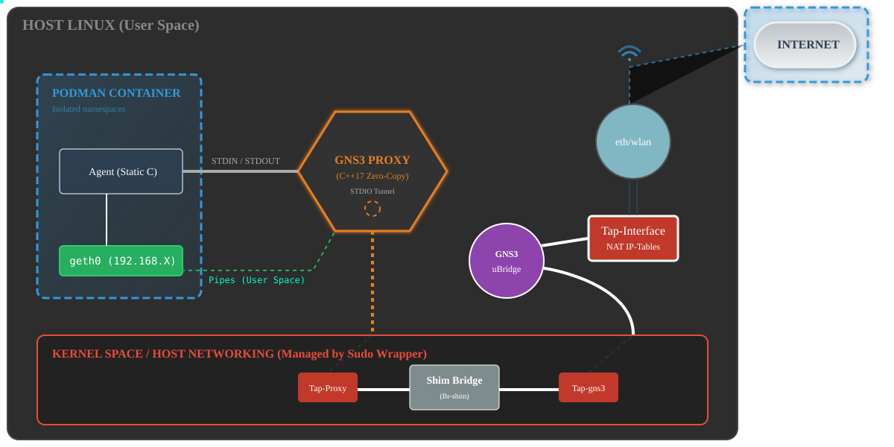
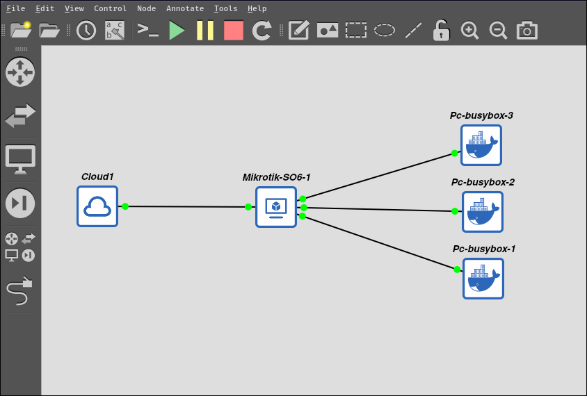
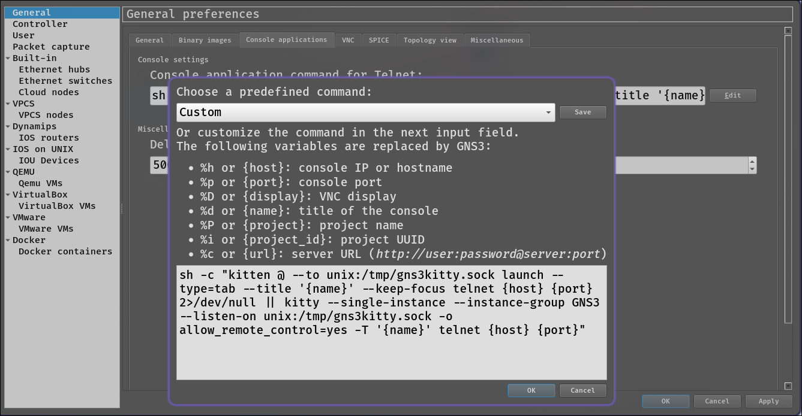
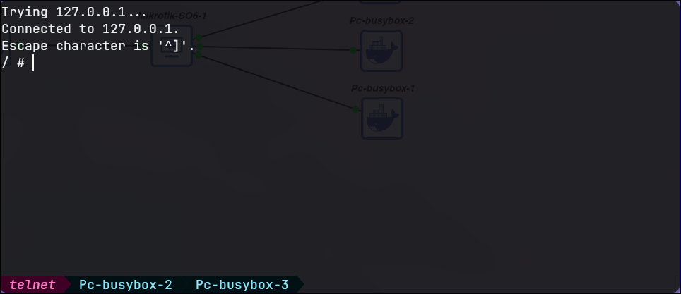

# GNS3 Server: Rootless Podman Integration

This project is a specialized extension for the
[GNS3 Server](https://github.com/GNS3/gns3-server) that enables native support for
**Rootless Podman**. It replaces the privileged Docker socket dependency with a secure,
user-space connectivity architecture, while automating the necessary privileged host
networking operations.

To minimize the overhead inherent in moving networking from kernel-space to user-space,
this project utilizes a custom **L2 Proxy** written in **C++17** and a static **C Agent**.

## 🎯 Purpose

Running network simulations traditionally requires running the entire container engine as
root. This extension improves security by isolating the responsibilities:

1. **Rootless Runtime:** Containers run strictly as the user (mapped via subuids),
   mitigating the risk of container breakouts.
2. **Privileged Network Orchestration:** A wrapper script handles the creation of Host
   TAPs, Bridges, and NAT rules using `sudo`, keeping the simulation network functional
   without exposing the Docker socket.
3. **Optimized Connectivity:** Replaces generic pipe handlers with a **Zero-Copy C++
   Proxy** to tunnel Ethernet frames via `STDIN/STDOUT`.

> **Architecture Note:** This solution acts as a transparent **Ethernet-over-STDIO
> tunnel**. While user-space proxying inherently has more overhead than kernel-level
> bridging, the C++ implementation ensures latency is minimized for real-time simulation.

---

## 🚀 Key Features

### 🔒 Hybrid Security Architecture

- **Rootless Containers:** The Podman runtime operates entirely within the user session.
- **Automated Sudo Management:** The `gns3-launch` wrapper creates a privileged "Sudo
  Keep-alive" session to handle network interfaces (TAP creation, IPTables NAT)
  transparently, improving the UX by asking for a password only once at startup.
- **Shim-Bridge System:** Links privileged Host TAPs to unprivileged container interfaces
  using a specialized bridging architecture.

### ⚡ Optimized User-Space Networking

- **C++17 Zero-Copy Proxy:** Uses `poll()` and native POSIX threads to bypass the Python
  GIL.
- **Static C Agent:** A lightweight binary injected into containers for ultra-low latency
  I/O.
- **Smart NAT Bridge:** Includes automated fixes for **TTL Exhaustion** and **UDP
  Checksum** offloading (essential for reliable routing/DNS in virtual topologies).

---

## 🛠️ Architecture



## 🛠️ Quick Installation

The installation script automates the compilation of binaries, system prerequisites, and
the patching of the GNS3 compute module.

### Prerequisites

- `g++` (with C++17 support) and `gcc`.
- `podman 5.7.0` installed.
- `gns3server 3.0.5` installed via your package manager or pip.

### Automated Setup

1. Clone this repository.
2. Run the installer:

```bash
chmod +x install.sh
./install.sh
```

The script will detect your Python version, compile the C++ tools, configure
`systemd-tmpfiles` for the Podman socket, and set `ubridge` capabilities.

---

## 🚀 Usage

Thanks to the integrated wrapper, it is no longer necessary to export environment
variables manually as was the case in the beta version, which is not available in this
repository. To start GNS3 with full support for Podman, simply run:

```bash
gns3-launch
```

### What `gns3-launch` does:

1. **Sudo Validation:** Prompts for your password **once** to authorize network operations
   (creating TAP interfaces and NAT rules). It maintains this session in the background so
   you can work uninterrupted.
2. **Environment Setup:** Exports `GNS3_USE_PODMAN=1`.
3. **Socket Check:** Auto-starts `podman.socket` (User Mode) if it's not running.
4. **Network Init:** Launches the `tap-gns3-internet.sh` script to enable Internet access
   (NAT) for your lab.
5. **Signal Trap:** When you close GNS3 (Ctrl+C), it automatically tears down the TAP
   interfaces and cleans up firewall rules.

---

## 🖥️ Supported Interfaces

> [!IMPORTANT] Current Compatibility:
>
> - ✅ **GNS3 Desktop GUI:** Fully supported.
> - ⚠️ **GNS3 Web UI:** Not currently supported.
>
> This patch is optimized for the Desktop client experience. Future updates will address
> Web UI compatibility.

---

## 🏗️ Architecture Detail

The solution implements a **Split-Privilege Model**, ensuring that heavy networking
operations remain secure while the runtime stays rootless.

1. **Host Networking (Privileged):** The `gns3-launch` wrapper uses `sudo` to configure
   the upstream NAT interface (`tap-interface`) and IPTables rules for internet access.
2. **GNS3 uBridge (User + Caps):** The standard GNS3 switching engine. It runs as your
   user (utilizing `cap_net_admin` capabilities) to handle the simulation topology and
   create the initial TAP interface.
3. **Shim Bridge Plumbing (Privileged):** GNS3 triggers ephemeral `sudo` commands to
   create a Linux Bridge (`br-shim`) that physically connects the **uBridge TAP** to the
   **Proxy TAP**, bridging the gap between kernel-space and user-space.
4. **C++ Proxy (User):** A high-performance user-space process that attaches to the Proxy
   TAP and tunnels raw Ethernet frames to the container via **STDIO Pipes**.
5. **C Agent (User/Rootless):** A static binary running inside the unprivileged container
   namespace. It captures the STDIO stream and reinjects frames into the container's
   internal `geth0` interface.

---

## 🛠️ Manual Installation (Optional)

If you prefer to configure the system manually instead of using `install.sh`, follow these
steps in order.

### 1. System Configuration (Prerequisites)

Configure the environment to allow GNS3 to find Podman as a replacement for Docker.

- **Create Docker Alias:**

```bash
sudo ln -s /usr/bin/podman /usr/local/bin/docker
```

- **Set up Podman Socket Symlink:** Create `/etc/tmpfiles.d/containers.conf` with the
  following content (replace `USER` and `UID` with your actual values):

```conf
d /run/containers 0755 root root
d /run/containers/storage 0700 USER USER
L /run/docker.sock - - - - /run/user/UID/podman/podman.sock
```

- **Apply Tmpfiles:** `sudo systemd-tmpfiles --create /etc/tmpfiles.d/containers.conf`.
- **Ubridge Permissions:** Grant network capabilities to the binary:

```bash
sudo setcap cap_net_admin,cap_net_raw+ep /usr/bin/ubridge
```

### 2. Binary Compilation

Compile the high-performance networking components:

- **Proxy (Host Side):** `g++ -O3 -pthread -o gns3-net-proxy gns3-net-proxy.cpp`.
- **Agent (Container Side):** `gcc -O2 -static -o gns3-net-agent gns3-net-agent.c`.

### 3. Files Deployment

Locate your GNS3 site-packages directory (e.g.,
`/usr/lib/python3.xx/site-packages/gns3server/compute/docker/`) and copy the files:

1. **Copy Files:** Move `docker_vm.py`, `gns3-net-proxy`, `gns3-net-agent`,
   `gns3-launch-server.sh`, and `tap-gns3-internet.sh` to that directory.
2. **Set Permissions:** Ensure the `.sh`, `gns3-net-proxy`, and `gns3-net-agent` files
   have execution permissions (`chmod +x`).
3. **Global Launcher:** Create a symbolic link for easy access:

```bash
sudo ln -s /path/to/gns3-launch-server.sh /usr/local/bin/gns3-launch
```

---

## 🖥️ Supported Interfaces

> [!IMPORTANT] This patch is currently designed to work exclusively with the
> **[GNS3 Desktop GUI](https://github.com/GNS3/gns3-gui)**.
>
> - **GNS3 Web UI:** Currently, containers will not connect to the web console or
>   auxiliary consoles in the web version.
> - **Future Updates:** Upcoming versions will include support for the Web UI, along with
>   enhanced security wrappers for proxy creation and server launching.

---

## 🎨 Recommended GUI Enhancements (Kitty Terminal)

For users on Linux using the **Kitty** terminal, you can achieve a seamless experience
where every container opens as a new **tab** within a single terminal window,
automatically labeled with the container's name.



### Configuration Steps:

1. Open GNS3 GUI and go to **Edit** > **Preferences**.
2. Navigate to **General** > **Console Applications**.
3. Click **Edit** on the "Console application command for Telnet".
4. Choose **Custom** and paste the following command:



```bash
sh -c "kitten @ --to unix:/tmp/gns3kitty.sock launch --type=tab --title '{name}' --keep-focus telnet {host} {port} 2>/dev/null || kitty --single-instance --instance-group GNS3 --listen-on unix:/tmp/gns3kitty.sock -o allow_remote_control=yes -T '{name}' telnet {host} {port}"
```



### Known Behavior

- **Tab Management:** The first container launched will initialize the Kitty instance.
  Subsequent containers will open as new tabs in that same window.
- **Note on Titles:** You may notice that the first tab is occasionally titled `telnet`
  while subsequent tabs correctly display the container's `{name}`. This is a known
  initialization behavior of the terminal wrapper.

---

## 📝 Modified Files

This project modifies/adds the following files in
`.../site-packages/gns3server/compute/docker/`:

- **Modified:** `docker_vm.py` (Extended Podman logic, Shim-Bridge orchestration).
- **Added:**
- `gns3-net-proxy` (C++ Binary).
- `gns3-net-agent` (Static C Binary).
- `tap-gns3-internet.sh` (Privileged Network Script).
- `gns3-launch-server.sh` (The Wrapper).

---

## 🔧 Maintenance & Uninstallation

If you wish to revert to the original GNS3 state, the uninstaller will remove all binaries
and download the original `docker_vm.py` file from the official GNS3 repository matching
your current version.

```bash
chmod +x uninstall.sh
./uninstall.sh
```

---

## 🤝 Contributing & Support

If this project helped you save time or solved a problem in your GNS3/Podman setup,
consider supporting its development. Your contributions help maintain the project and keep
it updated with the latest GNS3 versions.

<div align="left">
  <h3>Ways to support:</h3>

  <p>
    🌟 <b>Star this repository:</b> It helps more people find this tool.<br>
    🐞 <b>Open an issue:</b> Report bugs or suggest new features.
  </p>

  <div align="center">
    <p>If this tool was useful, consider supporting its maintenance.</p>
    <table align="center" style="border: none;">
      <tr>
        <td align="center" style="border: none; padding: 20px;">
          <a href="https://tecito.app/manubytes">
            
            <br><i>Tecito.app</i>
          </a>
        </td>
        <td align="center" style="border: none; padding: 20px;">
          
          <br>
          <a href="https://optimistic.etherscan.io/address/0x5447BdD6445Ea43Fd518835cb6c1bEe0b6D8558C" target="_blank" rel="noopener noreferrer">
            <kbd>0x5447BdD6445Ea43Fd518835cb6c1bEe0b6D8558C</kbd><small>📋</small>
          </a>
          <br><small>Supports:</small>
          <br><small>ETH, BSC, Polygon, OPtimism, Arbitrum, Mantle.</small>
        </td>
      </tr>
    </table>
  </div>
</div>

---

## 📄 License

This project is licensed under the **GPLv3** License - see the [LICENSE](LICENSE) file for
details.

**Made with ❤️ for the GNS3 Community.**
